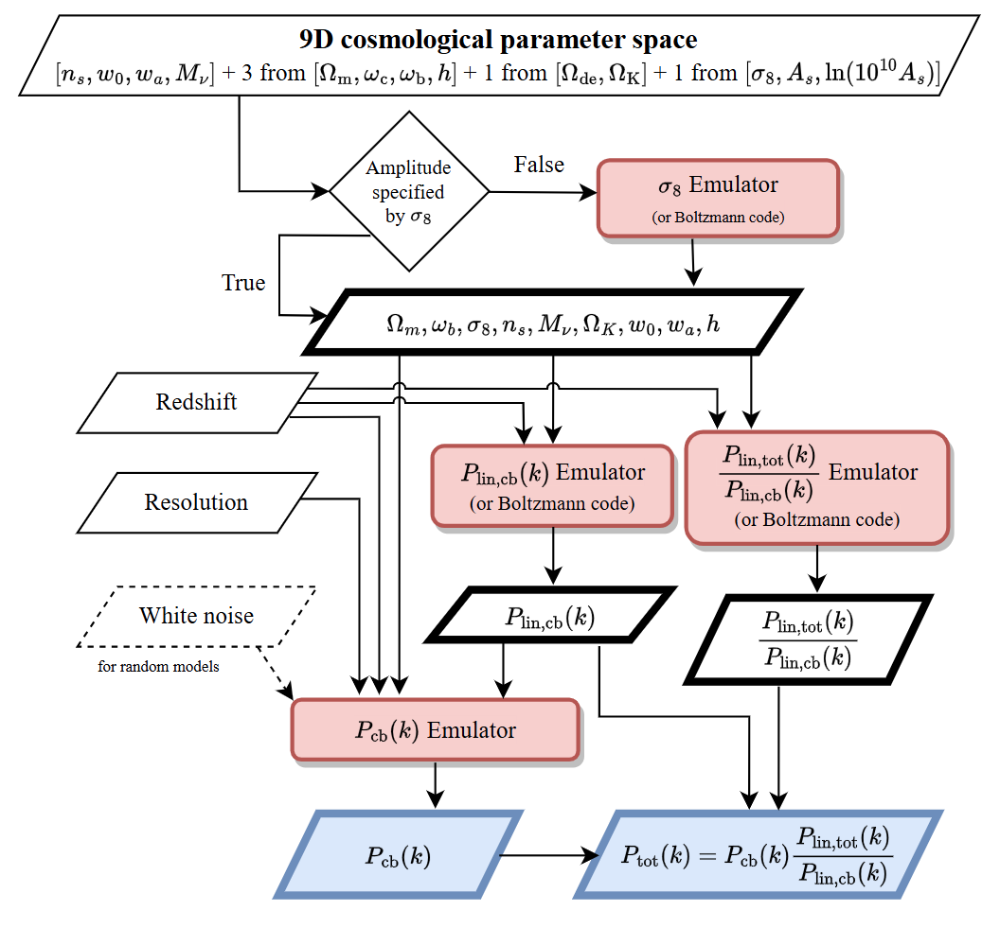

# Satoshi Tanaka's HP

<!--
[English](./index_en.html)
-->

## 研究内容

### 宇宙物理学

富岳などのスーパーコンピュータを使ったシミュレーションによって宇宙の大規模構造形成の研究を行っています。特にニュートリノの影響を正しく取り扱った大規模構造形成シミュレーションが特徴的です。また、宇宙論パラメータを推定するために、毎回大規模シミュレーションを行うことは現実的ではないので、シミュレーション結果を学習データにしたエミュレータ開発にも力を入れています。

  

    
<strong>富岳全系を使ったシミュレーション</strong>

    <iframe width="480" height="300" src="https://www.youtube.com/embed/Hwy11sb31S0?rel=0" frameborder="0" allow="accelerometer; autoplay; clipboard-write; encrypted-media; gyroscope; picture-in-picture" allowfullscreen></iframe>
  

  

    
<strong>DarkEmulator2</strong>

    
  

### データ駆動理学、解釈可能AI

ニューラルネットワークなどでモデルを構築できれば多くの物理現象をうまく再現してくれます。なぜうまくいくのかを数理的に理解する研究を行っています。

- キーワード : 宇宙物理学、宇宙論、大規模構造形成、ニュートリノ、Vlasovシミュレーション、高性能計算、機械学習、エミュレータ、ビッグデータ、 データ駆動理学、解釈可能AI

---

## プロフィール

- 2025.4-現職 一橋大学, ソーシャル・データサイエンス研究科, 特任助教
- 2020.4-2025.3 京都大学, 基礎物理学研究所 極限構造研究部門, 特定研究員
              (AIP加速課題 革新的画像解析技術を用いた広域宇宙撮像データ分析, 学術変革領域研究 ダークマターの正体は何か?)
- 2016.4-2020.3 筑波大学, 計算科学研究センター, 研究員 (ポスト京)
- 2015.4-2016.3 東京大学, 大学院理学系研究科, 特任研究員
- 2015.3 筑波大学, 数理物質科学研究科, 物理学専攻 博士後期課程 修了, 博士(物理学)
- 2010.3 筑波大学, 第一学群自然学類, 物理学専攻 卒業
- 2006.3 広島市立 基町高等学校 卒業

- [resarchmap](<https://researchmap.jp/satoshi.tanaka>)

---

## オープンソース

- [GitHub](<https://github.com/stanaka2>)
- [GitHub Gist](<https://gist.github.com/stanaka2>) : 主に計算機周りのメモ
- [MPI-Rockstar](<https://github.com/Tomoaki-Ishiyama/mpi-rockstar>) : Tomoyuki Tokuue, Tomoaki Ishiyama, Ken Osato, Satoshi Tanaka, and Peter Behroozi, 2024

---

## プロジェクト

- [Dark Quest Project Webpage](<https://darkquestcosmology.github.io/>)
- [シミュレーションとAIの融合で解明する宇宙の構造と進化](<https://www2.ccs.tsukuba.ac.jp/aiuniverse/>)
- 次世代宇宙論サーベイ群のための多波長宇宙論的シミュレーション
- [ダークマターの正体は何か？](<https://member.ipmu.jp/DarkMatter/>)

---

## リンク

- 一橋大学 [Data Driven Science Group](<https://mototakelab.github.io/>)

## 連絡先

- E-mail
  - satoshi.tanaka_AT_r.hit-u.ac.jp
  - satoshi.tanaka_AT_yukawa.kyoto-u.ac.jp
_AT_は@に変換

- アドレス
  - 〒186-8601 東京都国立市中2-1 一橋大学 (東キャンパス 第3研究館 201)
